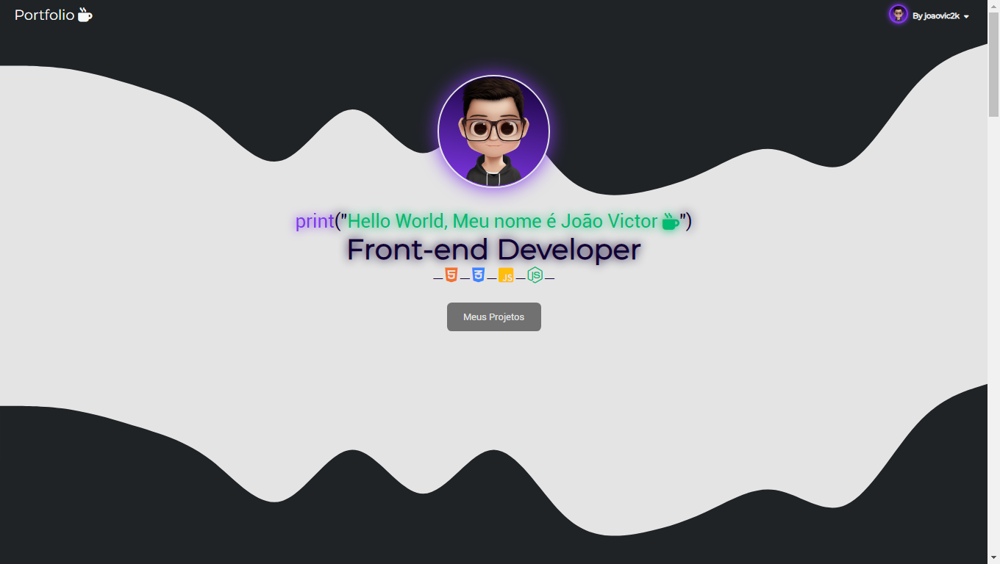
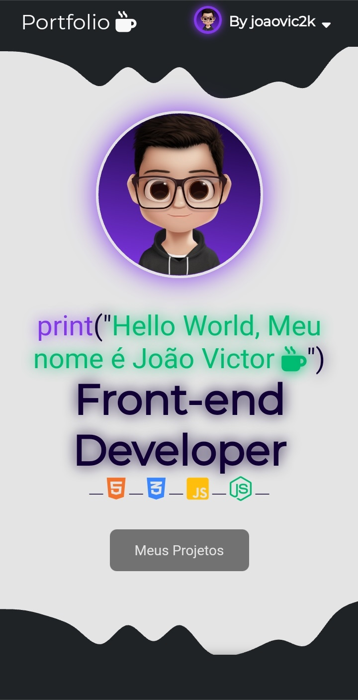
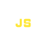

  <h1>Interface do portfolio</h1>
  

  <h2>Desktop</h2>
  
  

  <h2>Mobile</h2>
  

# <a href="https://nodejs.org/en/about/">Comandos ultilixados do NodeJs</a>

  <h3>npm init</h3> 
  
iniciar o node

  <h3>npm install express </h3> 
  
Express serve para gerencia as requisições, rotas e URLs, entre outra funcionalidades

  <h3>npm install -g nodemon</h3>
  
Nodemon é uma ferramenta que ajuda no processo de desenvolvimento de aplicações em Node. js, onde automaticamente detecta os arquivos alterados e reinicia a aplicação

  <h3>npm install --save-dev nodemon</h3>
  
Com essa instalação, ele ficará no projeto na parte de devDependencies.

<a href="https://programandosolucoes.dev.br/2021/04/27/configurar-utilizar-nodemon/">Saiba mais...</a>

 
  <h1>Tecnologias utulizadas:</h1>
  
   &nbsp;
   &nbsp;
   &nbsp;
   &nbsp;
   &nbsp;
   &nbsp;
   &nbsp;
  

